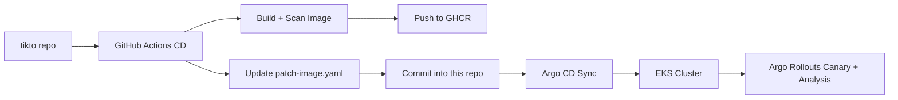

# ☸️ TikTo — GitOps Manifests

This repo manages the **desired state** of Kubernetes for the TikTo application, across both dev and prod-like environments. Argo CD reads this repo and automatically reconciles workloads onto the cluster — it's the single source of truth for what's actually running on K8s.

> 🔗 Related repos: [tikto](https://github.com/flavoriy/tikto) (builds & pushes images, auto-commits into this repo) · [Infrastructure-as-Code](https://github.com/flavoriy/Infrastructure-as-Code) (the underlying EKS infrastructure)

---

## 🔄 GitOps Delivery Flow



Key point: **the `tikto` repo never deploys directly**. It only builds/scans/pushes images, then auto-commits the new tag into this repo. Argo CD is the only thing that actually pushes changes onto the cluster — cleanly separating CI (build) from CD (deploy).

---

## 📂 Repository Layout

```
.
├── apps/
│   └── tikto/
│       ├── base/                          # Shared base K8s manifests
│       └── overlays/
│           ├── dev/                       # Dev environment overlay
│           └── prod/                      # Prod environment overlay (EKS)
│               ├── rollout.yaml               # Frontend Canary Rollout
│               ├── rollouts-backend.yaml      # API Gateway Canary Rollout
│               ├── analysis-opensearch.yaml   # OpenSearch log-scanning template
│               └── analysis-gateway-smoke.yaml# API Gateway smoke test
└── argocd/
    └── applications/                       # Argo CD Application manifests
```

Uses **Kustomize** (base + overlays) to avoid duplicating manifests between dev/prod — only the actual differences (image tag, replica count, resource limits...) are patched.

---

## 🚀 Argo Rollouts & Canary Deployment (Prod)

In the `tikto-prod` environment, both the Frontend (`tikto`) and API Gateway (`tikto-gateway`) use **Argo Rollouts** instead of a standard Deployment:

1. **Traffic Splitting**: Istio gradually shifts traffic: `10% → 50% → 80% → 100%`.
2. **Automated Smoke Test (`run-smoke-test`)**: a Job runs 200 curl requests against the canary endpoints (`tikto-canary`, `tikto-gateway-canary:4000/health`) before promoting.
3. **Log-based Analysis (`check-canary-errors`)**: queries AWS OpenSearch in real time via DSL. If the count of logs containing `error`/`failed`/`exception` tied to the canary's hash exceeds **5 within 2 minutes**, the rollout is marked failed and auto-rolled back.

---

## 🛠️ Common Operational Commands

### Apply Argo CD Applications

```bash
kubectl apply -f argocd/applications/tikto-dev.yaml
kubectl apply -f argocd/applications/tikto-prod.yaml
```

### Render manifests locally before applying

```bash
kubectl kustomize apps/tikto/overlays/dev
kubectl kustomize apps/tikto/overlays/prod
```

### Monitor rollout progress

```bash
kubectl argo rollouts get rollout tikto -n tikto-prod
kubectl argo rollouts get rollout tikto-gateway -n tikto-prod
```

### Manual control

```bash
# Manually promote
kubectl argo rollouts promote tikto-gateway -n tikto-prod

# Abort and roll back immediately
kubectl argo rollouts abort tikto-gateway -n tikto-prod
```

---

## 🔍 Troubleshooting

### ❌ OpenSearch metric queries fail

- **Cause**: Argo Rollouts' `web` metric provider defaults to `GET`, but OpenSearch DSL queries require `POST`.
- **Fix**: explicitly set the method in the `AnalysisTemplate`:

```yaml
provider:
  web:
    method: POST  # required for OpenSearch search payloads
    url: https://<opensearch-domain>/kubernetes-logs/_search
    headers:
      - key: Content-Type
        value: application/json
```

### ❌ Canary Rollout stuck in Suspended state

- **Cause**: the `pause: {}` step has no duration, requiring manual intervention to promote.
- **Fix**: always set an explicit duration so progressive delivery stays fully automated:

```yaml
steps:
  - setWeight: 20
  - pause: { duration: 1m }
  - setWeight: 50
  - pause: { duration: 1m }
```

---

## 🧱 Tech stack

`Kubernetes` `Kustomize` `Argo CD` `Argo Rollouts` `Istio` `AWS OpenSearch`
