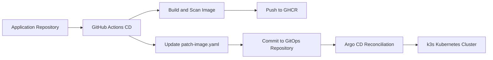

# TikTo GitOps Manifests

This repository is the GitOps source of truth for the `tikto` Kubernetes workload. Application repositories do not deploy by editing the cluster directly. Instead, CI/CD updates image references in this repository, and Argo CD reconciles the cluster to the desired state stored in Git.

## Responsibilities

- Store Kubernetes manifests for the `tikto` application.
- Provide a reusable Kustomize base and environment-specific overlays.
- Define Argo CD Applications for development and production.
- Keep deployment changes auditable through Git history.
- Keep secret values out of source control.

## Repository Layout

```text
.
|-- apps/
|   `-- tikto/
|       |-- base/
|       |   |-- deployment.yaml
|       |   |-- service.yaml
|       |   `-- kustomization.yaml
|       `-- overlays/
|           |-- dev/
|           |   |-- kustomization.yaml
|           |   |-- namespace.yaml
|           |   |-- configmap.yaml
|           |   |-- patch-image.yaml
|           |   |-- patch-replicas.yaml
|           |   |-- patch-service.yaml
|           |   |-- secret-store.yaml
|           |   |-- external-secret.yaml
|           |   `-- secret.example.yaml
|           `-- prod/
|               |-- kustomization.yaml
|               |-- namespace.yaml
|               |-- configmap.yaml
|               |-- patch-image.yaml
|               |-- patch-replicas.yaml
|               |-- patch-scheduling.yaml
|               |-- patch-service.yaml
|               |-- pdb.yaml
|               |-- secret-store.yaml
|               |-- external-secret.yaml
|               `-- secret.example.yaml
`-- argocd/
    |-- server-nodeport.yaml
    `-- applications/
        |-- tikto-dev.yaml
        `-- tikto-prod.yaml
```

## Environment Model

| Environment | Namespace | Overlay | Replicas | Secret Strategy | Notes |
|---|---|---|---:|---|---|
| Development | `tikto-dev` | `apps/tikto/overlays/dev` | 1 | External Secrets Operator reads `tikto/dev` from AWS Secrets Manager | Exposes app by NodePort `30443` for direct IP access |
| Production | `tikto-prod` | `apps/tikto/overlays/prod` | 3 | External Secrets Operator reads `tikto/prod` from AWS Secrets Manager | Uses spread constraints and a PDB for workload HA |

## Workload Standards

The base deployment includes:

- Rolling update strategy with `maxUnavailable: 0`.
- Readiness probe on `/api/health`.
- Liveness probe on the application HTTP port.
- CPU and memory requests and limits.
- Pod-level `runAsNonRoot: false` for the current container image.
- Container-level `allowPrivilegeEscalation: false`.
- Linux capabilities dropped with `drop: ["ALL"]`.
- Environment variables loaded from `tikto-config` and `tikto-secret`.

Production adds:

- Three replicas for the three-node production cluster.
- Topology spread constraints across `kubernetes.io/hostname` and `topology.kubernetes.io/zone`.
- Preferred pod anti-affinity to avoid concentrating replicas on one node or zone.
- A PodDisruptionBudget with `minAvailable: 2`.

## Access Model

This lab setup uses public EC2 IPs with NodePorts instead of DNS names:

| Component | Port | URL |
|---|---:|---|
| Argo CD server | `30080` | `https://<public-ip>:30080` |
| TikTo dev app | `30443` | `http://18.139.31.55:30443` |
| TikTo prod app | `30443` | `http://18.136.110.57:30443` |

The application port inside the pod is still `3000`; Kubernetes exposes it as Service port `80`, then NodePort `30443`.

## GitOps Flow



The application pipeline updates one of these files:

```text
apps/tikto/overlays/dev/patch-image.yaml
apps/tikto/overlays/prod/patch-image.yaml
```

Argo CD then syncs the corresponding Application:

```text
tikto-dev
tikto-prod
```

## Argo CD Applications

Apply the Application objects from the target cluster:

```bash
kubectl apply -f argocd/applications/tikto-dev.yaml
kubectl apply -f argocd/applications/tikto-prod.yaml
```

Both Applications are configured with:

- Automated sync.
- Prune enabled.
- Self-heal enabled.
- Namespace creation enabled.
- `PruneLast=true` to reduce destructive ordering issues during sync.

## Rendering and Validation

Render manifests locally before committing:

```bash
kubectl kustomize apps/tikto/overlays/dev
kubectl kustomize apps/tikto/overlays/prod
```

Dry-run against a cluster:

```bash
kubectl apply -k apps/tikto/overlays/dev --dry-run=server
kubectl apply -k apps/tikto/overlays/prod --dry-run=server
```

Check Argo CD state:

```bash
argocd app get tikto-dev
argocd app get tikto-prod
argocd app wait tikto-dev --health --sync --timeout 300
argocd app wait tikto-prod --health --sync --timeout 300
```

## Secret Management

Development uses External Secrets Operator:

- `SecretStore`: `apps/tikto/overlays/dev/secret-store.yaml`
- `ExternalSecret`: `apps/tikto/overlays/dev/external-secret.yaml`
- AWS Secrets Manager key: `tikto/dev`
- Kubernetes target Secret: `tikto-secret`

Production also uses External Secrets Operator:

- `SecretStore`: `apps/tikto/overlays/prod/secret-store.yaml`
- `ExternalSecret`: `apps/tikto/overlays/prod/external-secret.yaml`
- AWS Secrets Manager key: `tikto/prod`
- Kubernetes target Secret: `tikto-secret`

`secret.example.yaml` files are templates only and are not included in the Kustomize resources.

The EC2 instances that can run the `external-secrets` controller need an IAM instance profile with read access to the required Secrets Manager entries:

```json
{
  "Effect": "Allow",
  "Action": [
    "secretsmanager:GetSecretValue",
    "secretsmanager:DescribeSecret"
  ],
  "Resource": [
    "arn:aws:secretsmanager:ap-southeast-1:<account-id>:secret:tikto/dev-*",
    "arn:aws:secretsmanager:ap-southeast-1:<account-id>:secret:tikto/prod-*"
  ]
}
```

If the secrets use a customer-managed KMS key, also allow `kms:Decrypt` for that key.

EC2 metadata options must allow pods to use the node instance profile:

- `HttpEndpoint`: `enabled`
- `HttpPutResponseHopLimit`: `2`
- `HttpTokens`: `required` when the workload supports IMDSv2, otherwise `optional`

Do not grant broad `ec2:*` permissions for External Secrets; it only needs Secrets Manager read access, plus KMS decrypt when applicable.

Do not commit real database URLs, API tokens, OAuth client secrets, signing keys, or encryption keys. Use a cluster secret manager, External Secrets Operator, Sealed Secrets, or another approved secret delivery mechanism for real environments.

## Operational Notes

- Treat this repository as the deployment source of truth.
- Avoid manual `kubectl edit` changes for managed resources because Argo CD will reconcile them back to Git.
- Roll back by reverting the Git commit that changed the image reference.
- Keep environment-specific differences in overlays, not in copied base manifests.
- Keep image tags immutable and traceable to the application commit and CI/CD run.
