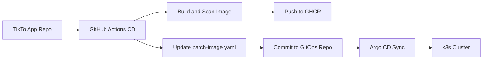

# TikTo GitOps Manifests

This repository stores the Kubernetes desired state for my personal TikTo DevOps platform. It separates deployment configuration from application source code and lets Argo CD reconcile the dev and production-like k3s environments from Git.

The application code lives in the TikTo app repository, AWS infrastructure lives in the IaC repository, and this repository owns the runtime Kubernetes manifests.

## Resume Highlights

- Built a GitOps deployment repository with Kustomize base and environment overlays.
- Defined Argo CD `Application` resources for dev and production-like environments.
- Separated application code, infrastructure code, and deployment configuration into different repositories.
- Used External Secrets Operator with AWS Secrets Manager to avoid committing Kubernetes Secret values.
- Configured production-like workload HA with three replicas, topology spread constraints, and a PodDisruptionBudget.
- Documented operational troubleshooting for image pull issues, missing ExternalSecret CRDs, and EC2 IMDS credential access.

## Repository Layout

```text
.
|-- apps/
|   `-- tikto/
|       |-- base/
|       |   |-- deployment.yaml
|       |   |-- service.yaml
|       |   `-- kustomization.yaml
|       `-- overlays/
|           |-- dev/
|           |   |-- namespace.yaml
|           |   |-- configmap.yaml
|           |   |-- patch-image.yaml
|           |   |-- patch-replicas.yaml
|           |   |-- patch-service.yaml
|           |   |-- secret-store.yaml
|           |   |-- external-secret.yaml
|           |   `-- secret.example.yaml
|           `-- prod/
|               |-- namespace.yaml
|               |-- configmap.yaml
|               |-- patch-image.yaml
|               |-- patch-replicas.yaml
|               |-- patch-scheduling.yaml
|               |-- patch-service.yaml
|               |-- pdb.yaml
|               |-- secret-store.yaml
|               |-- external-secret.yaml
|               `-- secret.example.yaml
`-- argocd/
    |-- server-nodeport.yaml
    `-- applications/
        |-- tikto-dev.yaml
        `-- tikto-prod.yaml
```

## Environment 

| Environment | Namespace | Overlay | Replicas | Runtime secrets | Notes |
|---|---|---|---:|---|---|
| Development | `tikto-dev` | `apps/tikto/overlays/dev` | 1 | AWS Secrets Manager key `tikto/dev` | Direct IP access through NodePort `30443` |
| Production | `tikto-prod` | `apps/tikto/overlays/prod` | 3 | AWS Secrets Manager key `tikto/prod` | Topology spread, pod anti-affinity, and PDB |

## Workload Configuration

The shared base deployment defines:

- Rolling update strategy with `maxUnavailable: 0`.
- Readiness probe on `/api/health`.
- TCP liveness probe on the application HTTP port.
- Resource requests and limits.
- Environment variables loaded from `tikto-config` and `tikto-secret`.
- Container security context with privilege escalation disabled and Linux capabilities dropped.

The production overlay adds:

- `replicas: 3` for the three-node production-like cluster.
- `topologySpreadConstraints` across `kubernetes.io/hostname` and `topology.kubernetes.io/zone`.
- Preferred pod anti-affinity to reduce replica concentration on one node or zone.
- `PodDisruptionBudget` with `minAvailable: 2`.


## GitOps Flow



The application pipeline updates one of these files:

```text
apps/tikto/overlays/dev/patch-image.yaml
apps/tikto/overlays/prod/patch-image.yaml
```

Argo CD then reconciles the matching application:

```text
tikto-dev
tikto-prod
```

## Argo CD Applications

Apply the Argo CD application objects from the target cluster:

```bash
kubectl apply -f argocd/applications/tikto-dev.yaml
kubectl apply -f argocd/applications/tikto-prod.yaml
```

Both applications are configured with:

- Automated sync.
- Prune enabled.
- Self-heal enabled.
- Namespace creation enabled.
- `PruneLast=true` to reduce destructive ordering issues during sync.

If Argo CD is already installed and the application exists, refresh and sync:

```bash
kubectl -n argocd annotate application tikto-prod argocd.argoproj.io/refresh=hard --overwrite
argocd app sync tikto-prod --prune
argocd app wait tikto-prod --health --sync --timeout 300
```

Without Argo CD CLI, Kubernetes resources can be applied directly for troubleshooting:

```bash
kubectl apply -k apps/tikto/overlays/prod
```

## Rendering and Validation

Render manifests locally before committing:

```bash
kubectl kustomize apps/tikto/overlays/dev
kubectl kustomize apps/tikto/overlays/prod
```

Dry-run against a cluster:

```bash
kubectl apply -k apps/tikto/overlays/dev --dry-run=server
kubectl apply -k apps/tikto/overlays/prod --dry-run=server
```

## Secret Management

Development uses External Secrets Operator:

- `SecretStore`: `apps/tikto/overlays/dev/secret-store.yaml`
- `ExternalSecret`: `apps/tikto/overlays/dev/external-secret.yaml`
- AWS Secrets Manager key: `tikto/dev`
- Kubernetes target Secret: `tikto-secret`

Production-like uses External Secrets Operator:

- `SecretStore`: `apps/tikto/overlays/prod/secret-store.yaml`
- `ExternalSecret`: `apps/tikto/overlays/prod/external-secret.yaml`
- AWS Secrets Manager key: `tikto/prod`
- Kubernetes target Secret: `tikto-secret`

`secret.example.yaml` files are templates only and are not included in Kustomize resources.

The EC2 instances that can run the `external-secrets` controller need an IAM instance profile with read access to the required Secrets Manager entries:

```json
{
  "Effect": "Allow",
  "Action": [
    "secretsmanager:GetSecretValue",
    "secretsmanager:DescribeSecret"
  ],
  "Resource": [
    "arn:aws:secretsmanager:ap-southeast-1:<account-id>:secret:tikto/dev-*",
    "arn:aws:secretsmanager:ap-southeast-1:<account-id>:secret:tikto/prod-*"
  ]
}
```

If the secrets use a customer-managed KMS key, also allow `kms:Decrypt` for that key.

EC2 metadata options must allow pods to use the node instance profile:

- `HttpEndpoint`: `enabled`
- `HttpPutResponseHopLimit`: `2`
- `HttpTokens`: `required` when the workload supports IMDSv2, otherwise `optional`

Do not grant broad `ec2:*` permissions for External Secrets; it only needs Secrets Manager read access, plus KMS decrypt when applicable.

## Troubleshooting

### ImagePullBackOff

Check the image tag in the prod overlay:

```bash
grep -R "image:" apps/tikto/overlays/prod/patch-image.yaml
kubectl -n tikto-prod get events --sort-by=.lastTimestamp
```

If pods are trying to pull an old tag such as `prod-bootstrap`, pull the latest GitOps repository state and reapply or sync Argo CD.

### ExternalSecret CRDs Missing

If `kubectl apply -k` fails with `no matches for kind "ExternalSecret"` or `SecretStore`, install External Secrets Operator first:

```bash
helm repo add external-secrets https://charts.external-secrets.io
helm repo update

helm upgrade --install external-secrets external-secrets/external-secrets \
  -n external-secrets \
  --create-namespace \
  --set installCRDs=true
```

For k3s, make sure Helm uses the k3s kubeconfig:

```bash
export KUBECONFIG=/etc/rancher/k3s/k3s.yaml
```

### Missing `tikto-secret`

If pods show `CreateContainerConfigError` with `secret "tikto-secret" not found`, check External Secrets first:

```bash
kubectl -n tikto-prod get secretstore,externalsecret,secret
kubectl -n tikto-prod describe secretstore aws-secretsmanager
kubectl -n tikto-prod describe externalsecret tikto-secret
kubectl -n tikto-prod get events --sort-by=.lastTimestamp
```

The event `failed to refresh cached credentials, no EC2 IMDS role found` means the `external-secrets` controller cannot read AWS credentials from the node instance profile. Find the node running the controller:

```bash
kubectl -n external-secrets get pods -o wide
```

On that EC2 node, verify IMDS returns an IAM role:

```bash
TOKEN=$(curl -s -X PUT "http://169.254.169.254/latest/api/token" \
  -H "X-aws-ec2-metadata-token-ttl-seconds: 21600")

curl -s -H "X-aws-ec2-metadata-token: $TOKEN" \
  http://169.254.169.254/latest/meta-data/iam/security-credentials/
```

If the host returns a role but External Secrets still fails, re-check the EC2 metadata hop limit and restart the controller:

```bash
kubectl -n external-secrets rollout restart deployment/external-secrets
kubectl -n external-secrets rollout status deployment/external-secrets --timeout=180s
kubectl apply -k apps/tikto/overlays/prod
```

When `tikto-secret` exists, restart the application rollout:

```bash
kubectl -n tikto-prod rollout restart deployment/tikto
kubectl -n tikto-prod rollout status deployment/tikto --timeout=300s
kubectl -n tikto-prod get pods -o wide
```

## Operational Notes

- Treat this repository as the deployment source of truth.
- Avoid manual `kubectl edit` changes for managed resources because Argo CD will reconcile them back to Git.
- Roll back by reverting the Git commit that changed the image reference.
- Keep environment-specific differences in overlays, not copied base manifests.
- Keep image tags immutable and traceable to the application commit and CI/CD run.

