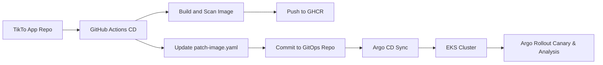

# ☸️ TikTo GitOps Manifests

This repository manages the declarative Kubernetes desired state for the TikTo application across development and production-like environments, enabling Argo CD to reconcile workloads automatically.

---

## 🔄 GitOps Delivery Flow



---

## 📂 Repository Layout

```text
.
├── apps/
│   └── tikto/
│       ├── base/               # Common base K8s manifests
│       └── overlays/
│           ├── dev/            # Development environment overlay
│           └── prod/           # Production-like EKS environment overlay
│               ├── rollout.yaml              # Frontend Canary Rollout
│               ├── rollouts-backend.yaml     # API Gateway Canary Rollout
│               ├── analysis-opensearch.yaml  # OpenSearch log-scanning template
│               └── analysis-gateway-smoke.yaml # API Gateway curl smoke test
└── argocd/
    └── applications/           # Argo CD Application manifests
```

---

## 🚀 Argo Rollouts & Canary Configurations

For **Production (`tikto-prod`)**, the application uses **Argo Rollouts** instead of standard Deployments for both the Frontend (`tikto`) and the API Gateway (`tikto-gateway`). The rollout features:

1. **Traffic Splitting**: Shifting ingress traffic using Istio (e.g. 10% $\rightarrow$ 50% $\rightarrow$ 80% $\rightarrow$ 100%).
2. **Automated Smoke Tests (`run-smoke-test`)**: A Kubernetes job pod runs 200 HTTP curl requests against the Canary service endpoints (`http://tikto-canary` and `http://tikto-gateway-canary:4000/health`) before promoting.
3. **Automated Log Monitoring (`check-canary-errors`)**: Queries the AWS OpenSearch cluster using DSL in real-time. If the count of error logs containing `error`, `failed`, or `exception` associated with the new Canary hash exceeds `5` within the last 2 minutes, the rollout is marked as failed and automatically rolled back.

---

## 🛠️ Useful Commands

### Apply Argo CD Applications
```bash
kubectl apply -f argocd/applications/tikto-dev.yaml
kubectl apply -f argocd/applications/tikto-prod.yaml
```

### Locally Render Manifests
```bash
kubectl kustomize apps/tikto/overlays/dev
kubectl kustomize apps/tikto/overlays/prod
```

### Monitor Rollout Progress
```bash
# Monitor Frontend Rollout
kubectl argo rollouts get rollout tikto -n tikto-prod

# Monitor API Gateway Rollout
kubectl argo rollouts get rollout tikto-gateway -n tikto-prod
```

### Control Rollouts (Manual Override)
```bash
# Manually promote a rollout
kubectl argo rollouts promote tikto-gateway -n tikto-prod

# Abort and trigger automatic rollback
kubectl argo rollouts abort tikto-gateway -n tikto-prod
```

---

## 🔍 Troubleshooting & Fixes

### ❌ OpenSearch Web Metric Queries Fail (HTTP GET vs. POST)
* **Issue**: Argo Rollouts' `web` metric provider fails to query OpenSearch.
* **Cause**: By default, the `web` metric provider defaults to the HTTP `GET` method. However, querying OpenSearch using a custom JSON DSL query requires an HTTP `POST` request.
* **Solution**: Explicitly set the method to `POST` inside the `AnalysisTemplate`:
  ```yaml
  provider:
    web:
      method: POST  # CRITICAL: Must be POST for OpenSearch search payloads
      url: https://<opensearch-domain>/kubernetes-logs/_search
      headers:
        - key: Content-Type
          value: application/json
  ```

### ❌ Canary Rollouts Stuck in Suspended State
* **Issue**: The rollout is stuck at a certain step indefinitely.
* **Cause**: The canary strategy used a pause step without a duration (`pause: {}`), which requires manual intervention to promote.
* **Solution**: Define a specific duration (e.g., `pause: { duration: 1m }`) for all steps to make the progressive delivery completely automated.
```yaml
steps:
  - setWeight: 20
  - pause: { duration: 1m }
  - setWeight: 50
  - pause: { duration: 1m }
```
